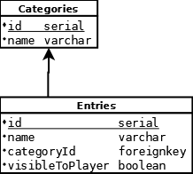

# data-service

A Python 3.11 backend REST API service written to retrieve several data points from a database (tbd).

Uses [FastAPI](https://fastapi.tiangolo.com/).

## Authors

- [@torbendury](https://www.github.com/torbendury)

## Run Locally

**UPDATE**: It is **strongly recommended** to run the application in a containerized way so it can start up with all its dependencies much easier. See [docker-compose](../hacks/docker-compose/README.md) for more about this.

If you **know the drills** and have a **separate DB ready** on your machine, go on here.

To run the project locally, make sure you have Python 3.11 installed. If you don't, get it [here](https://www.python.org/downloads/).

When `python` is installed, install Pythons package manager `pip`:

```bash
  python -m ensurepip
```

Clone the project:

```bash
  git clone git@github.com:torbendury/zero-bounce.git
```

Go to the project directory:

```bash
  cd backend/data-service/src/
```

Create a virtual Python environment + install dependencies

```bash
  # if necessary install virtualenv
  pip install virtualenv
  python -m virtualenv venv
  # on Windows:
  venv/scripts/activate.ps1 
  # if venv/scripts/activate.ps1 does not work, you might need to use venv/scripts/activate.bat
  pip install -r ../requirements.txt
```

Start the server

```bash
  uvicorn main:app --reload
  # on Windows:
  uvicorn.exe main:app --reload
```

## API Documentation

The FastAPI service ships with API docs included. When you started the service locally, you can grab them at [localhost:8000/docs](http://localhost:8000/docs)

### Available APIs

The `data-service` is right now intended to retrieve data for:

- The character that you are playing
- The archive data you have access to
- The map data you have access to
- A general overview (tbd)

The service is structured with multiple URL prefixes derived from the tasks they perform.

**If you want the latest documentation about available APIs - and, most importantly, the usage guide for them, start up the service with the [docker-compose](../../hacks/docker-compose/docker-compose.yml) file and type [http://localhost:8080](http://localhost:8080) into your browser.**

## Running Tests

### Unit Tests and Test Coverage

Unit tests including test coverage reports are fully containerized. For now, they can be called from a PowerShell script (bash script TODO) [here](../ci/data-service.ps1).

If you want to run the unit tests and test coverage from a Linux machine before a bash script resides there, copy-paste the commands from inside the script since `docker compose` is used.

The tests run against the FastAPI application which is connected to a PostgreSQL. By running fixtures before and after each test, the database is always in a clear and concise state.

## Build

The application ships as a container.

To build the container, use [the Dockerfile](../ci/Dockerfile_data-service) and set the build context to the [base path](data-service/) of the application.

## Directory structure

The source code is structured as following:

```bash
.
├── core              # core module for app settings, DB connection, DB models, schema validation
│   ├── database.py   # core DB connection settings
│   ├── models        # DB models
│   ├── schemas       # pydantic schemas for schema validation
│   └── settings.py   # core application settings, read from environment variables
├── main.py           # main application
├── requirements.txt  # pip requirements for your venv and for container builds
├── tests             # WORK IN PROGRESS
└── v1                # available APIs for app v1
    ├── crud          # CRUD operations for path operations
    ├── mock          # mock data, to be deleted - waits for document db
    └── routers       # available API paths
```

## Database references


