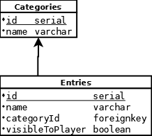

# data-service

A Python 3.11 backend REST API service written to retrieve several data points from a database (tbd).

Uses [FastAPI](https://fastapi.tiangolo.com/).

## Authors

- [@torbendury](https://www.github.com/torbendury)

## Run Locally

To run the project locally, make sure you have Python 3.11 installed. If you don't, get it [here](https://www.python.org/downloads/).

When `python` is installed, install Pythons package manager `pip`:

```bash
  python -m ensurepip
```

Clone the project:

```bash
  git clone git@github.com:torbendury/zero-bounce.git
```

Go to the project directory:

```bash
  cd backend/data-service/src/
```

Create a virtual Python environment + install dependencies

```bash
  # if necessary install virtualenv
  pip install virtualenv
  python -m virtualenv venv
  # on Windows:
  venv/scripts/activate.ps1 
  # if venv/scripts/activate.ps1 does not work, you might need to use venv/scripts/activate.bat
  pip install -r ../requirements.txt
```

Start the server

```bash
  uvicorn main:app --reload
  # on Windows:
  uvicorn.exe main:app --reload
```

## API Documentation

The FastAPI service ships with API docs included. When you started the service locally, you can grab them at [localhost:8000/docs](http://localhost:8000/docs)

### Available APIs

The `data-service` is right now intended to retrieve data for:

- The character that you are playing
- The archive data you have access to
- The map data you have access to
- A general overview (tbd)

The service is structured with multiple URL prefixes derived from the tasks they perform.

**If you want the latest documentation about available APIs - and, most importantly, the usage guide for them, start up the service with the [docker-compose](../../hacks/docker-compose/docker-compose.yml) file and type [http://localhost:8080/docs](http://localhost:8080/docs) into your browser.**

## Running Tests

### Unit Tests

To install testing dependencies and run tests:

```bash
  pip install -r test-requirements.txt

  python -m pytest ./
```

#### Test Coverage

For measuring test coverage, we use the `coverage` package which can also be installed from the `test-requirements.txt` via `pip`.

To measure coverage, run:

```bash
  cd src/
  coverage run -m pytest ./
  coverage report -m
```

The output will look something like this:

```bash
(venv) PS C:\Users\XXXXXXXXXX\zero-bounce\backend\data-service\src> coverage run -m pytest ./
================================================================================================ test session starts ================================================================================================ 
platform win32 -- Python 3.11.0, pytest-7.2.0, pluggy-1.0.0
rootdir: C:\Users\Torben Dury\Desktop\Tech\Projekte\zero-bounce\backend\data-service\src
plugins: anyio-3.6.2
collected 7 items                                                                                                                                                                                                     

test_main.py .......                                                                                                                                                                                           [100%] 

================================================================================================= 7 passed in 0.40s ================================================================================================= 
(venv) PS C:\Users\XXXXXXXXXXX\zero-bounce\backend\data-service\src> coverage report -m       
Name                  Stmts   Miss  Cover   Missing
---------------------------------------------------
__init__.py               0      0   100%
main.py                   8      0   100%
mock\__init__.py          0      0   100%
mock\archive.py           8      0   100%
routers\__init__.py       0      0   100%
routers\archive.py       22      0   100%
test_main.py             32      0   100%
---------------------------------------------------
TOTAL                    70      0   100%
```

## Build

The application ships as a Docker container. In the base directory of the application, `backend/data-service/`, run:

```bash
  docker build -t zero-bounce/data-service:dev ./
```

## Directory structure

The source code is structured as following:

```bash
.
├── README.md # the one you are reading
├── src
|   ├── __init__.py       # declaring the code below as a callable module
|   ├── main.py           # the main FastAPI module being called
|   ├── mock              # a directory containing mock data which can also be imported like a python module
|   ├── routers           # different API 'routers' - read more on https://fastapi.tiangolo.com/tutorial/bigger-applications/#apirouter
|   └── test_main.py      # unit tests
├── Dockerfile            # build file for building a docker container
├── requirements.txt      # pip packages which can be installed via `pip install -r requirements.txt`
└── test-requirements.txt # pip packages required for running tests
```

## Database references


